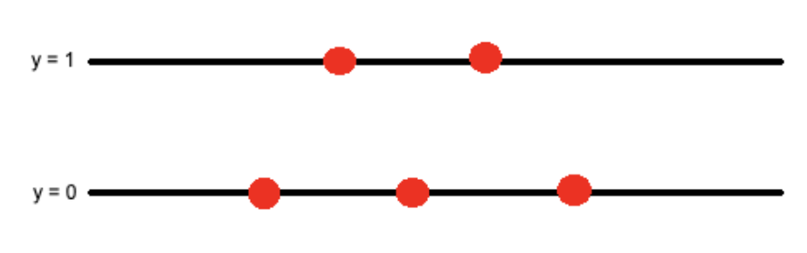
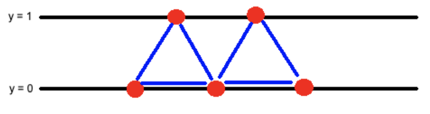

# Helenas-Triangles-Solver

LP solver for the Helena's Triangles Problem

Helena's Triangles is a game that consists in creating Triangles that don't share edges with each other given a group of nodes that belong to one of 2 parallel lines.

This is an example of a solution to the Helena's Triangles Problem: with a graph of 2 nodes on the Top row and 3 nodes on the Bottom row, the maximum number of triangles that can be drawn without sharing edges between them is 2.
